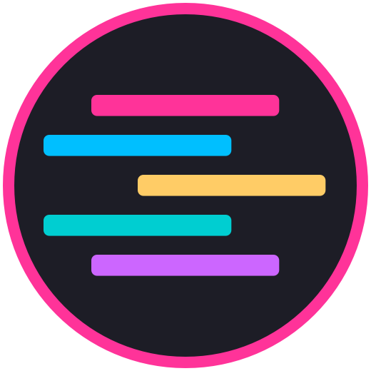
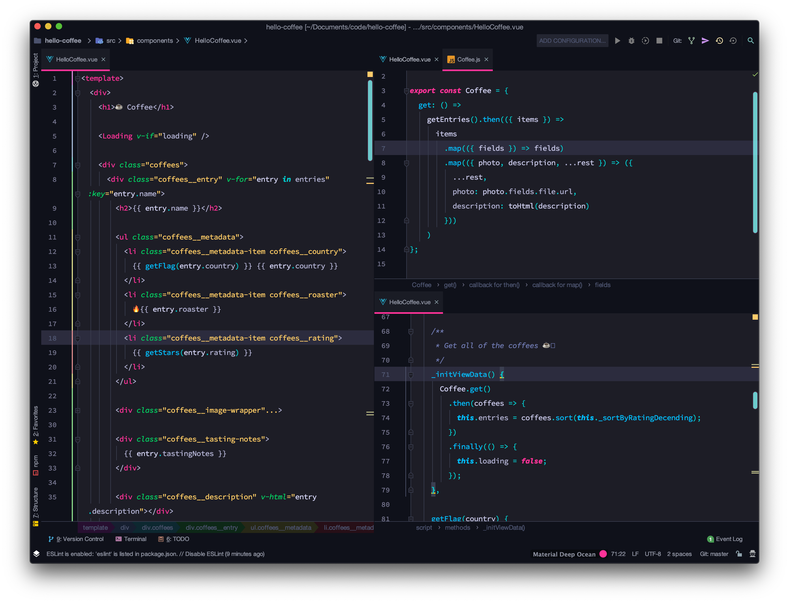

# Tinacious Design theme for Jetbrains

**Tinacious Design** is a syntax theme that uses a bright palette of colours including pink, blue, turquoise, green, purple, and orange.

The editor theme above is Material UI Deep Ocean with `#ff3399` as the accent colour.

## Other Editors

- [Visual Studio Code](https://github.com/tinacious/vscode-tinacious-design-syntax)
- [iTerm](https://github.com/tinacious/iterm-tinacious-design-theme)
- [Sublime Text](https://github.com/tinacious/sublime-tinacious-design-syntax)
- Atom [Dark](https://github.com/tinacious/atom-tinacious-design-syntax) and [Light](https://github.com/tinacious/atom-tinacious-design-light-syntax) (unmaintained)
